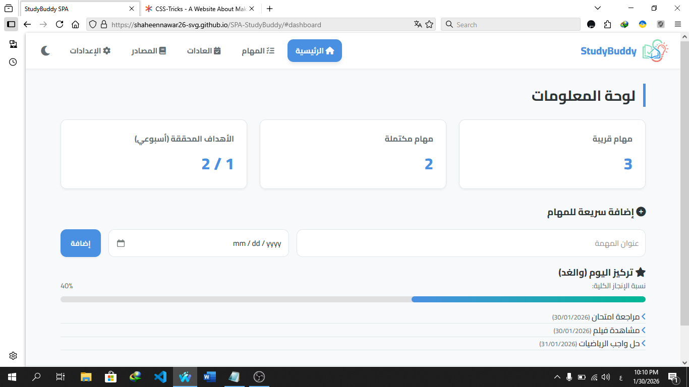
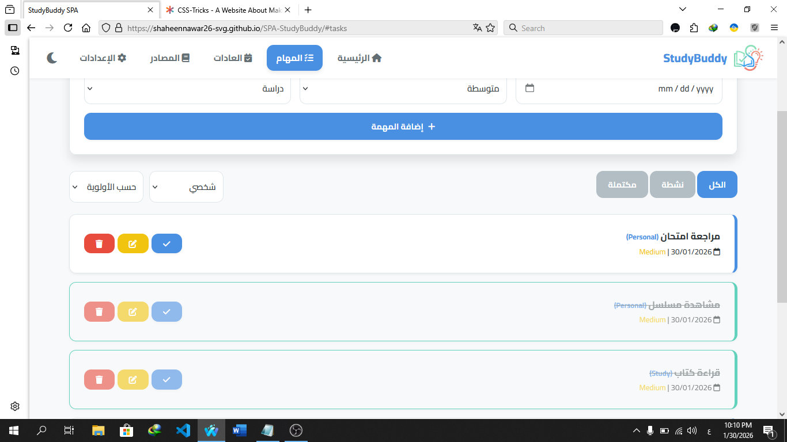
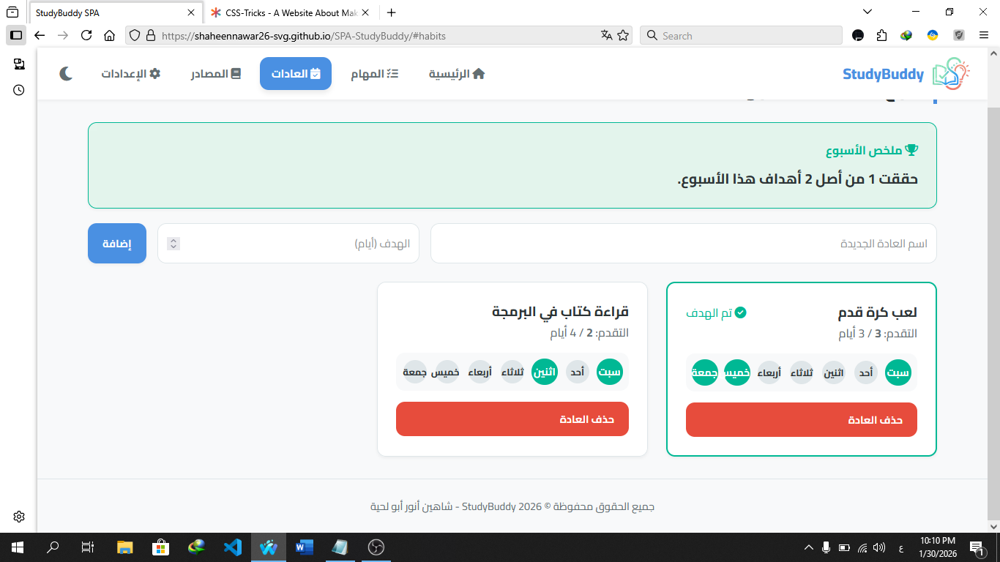
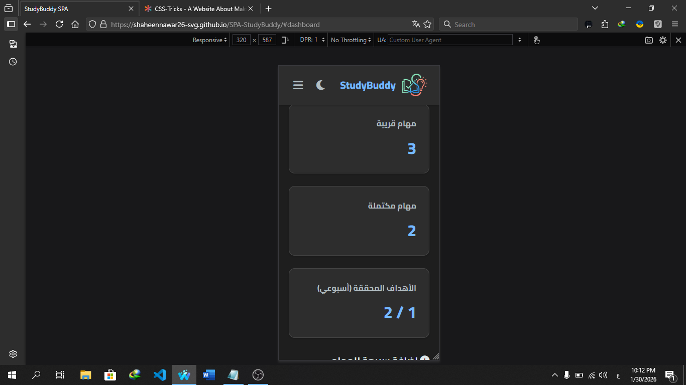

# 📚 StudyBuddy - رفيقك الدراسي الذكي

## 📝 وصف المشروع
**StudyBuddy** هو تطبيق ويب من صفحة واحدة (Single Page Application - SPA) تم تطويره لمساعدة الطلاب على تنظيم حياتهم الدراسية بفعالية. يهدف التطبيق إلى دمج أدوات الإنتاجية الأساسية في واجهة واحدة عصرية وسهلة الاستخدام.

يساعدك التطبيق على إدارة مهامك الدراسية، تتبع عاداتك الأسبوعية، والوصول إلى مصادرك التعليمية المفضلة، مع حفظ كافة البيانات تلقائياً في المتصفح لضمان عدم ضياعها.

---

## ✨ قائمة الميزات

يتميز التطبيق بمجموعة واسعة من الخصائص التقنية والوظيفية:

1.  **⚡ واجهة تفاعلية سريعة (SPA):** التنقل بين الأقسام (المهام، العادات، المصادر) يتم فورياً دون إعادة تحميل الصفحة.
2.  **✅ نظام إدارة المهام (CRUD):**
    * إضافة مهام مع تفاصيل (العنوان، الوصف، التاريخ، الأولوية، التصنيف).
    * تعديل وحذف المهام بسهولة.
    * تمييز المهام كمكتملة.
3.  **🔍 الفلترة والترتيب:**
    * عرض المهام حسب الحالة (نشطة/مكتملة).
    * فلترة حسب التصنيف (دراسة، واجب، شخصي).
    * ترتيب المهام حسب التاريخ أو الأولوية.
4.  **📅 تتبع العادات (Habit Tracker):**
    * نظام أسبوعي لتتبع العادات.
    * تحديد هدف أسبوعي لكل عادة (عدد الأيام).
    * مؤشرات بصرية عند تحقيق الهدف.
5.  **📚 مكتبة المصادر:**
    * عرض مصادر تعليمية متنوعة.
    * إمكانية البحث في المصادر.
    * إضافة المصادر إلى "المفضلة" للوصول السريع.
6.  **📊 لوحة تحكم (Dashboard):**
    * إحصائيات فورية (المهام المكتملة، المهام القريبة، نسبة الإنجاز).
    * شريط تقدم (Progress Bar) تفاعلي.
7.  **🎨 تجربة مستخدم مخصصة:**
    * دعم الوضع الليلي (Dark Mode) والنهاري.
    * تصميم متجاوب (Responsive) يعمل بكفاءة على الهواتف والحواسيب.
8.  **💾 حفظ البيانات:** يعتمد التطبيق على `LocalStorage` لحفظ جميع بياناتك وإعداداتك في المتصفح.

---

## 🚀 طريقة التشغيل

للتأكد من عمل التطبيق (خاصة قسم المصادر الذي يجلب البيانات من ملف JSON)، يفضل تشغيله عبر خادم محلي (Local Server).

### الخطوات:
1.  **تحميل الملفات:** قم بتنزيل مجلد المشروع كاملاً.
2.  **بيئة العمل:** افتح المجلد باستخدام محرر الأكواد **VS Code**.
3.  **التشغيل (الخيار الأفضل):**
    * قم بتثبيت إضافة **Live Server** في VS Code.
    * اضغط بزر الفأرة الأيمن على ملف `index.html` واختر `Open with Live Server`.
4.  **التشغيل التقليدي:** يمكنك فتح ملف `index.html` مباشرة في المتصفح (قد لا تعمل ميزة جلب المصادر `fetch` في بعض المتصفحات بسبب سياسات الأمان CORS عند فتح الملف مباشرة).

---

## 📸 لقطات الشاشة (Screenshots)

> **ملاحظة:** الصور أدناه توضح واجهة التطبيق في الوضعين النهاري والليلي وعلى الهاتف.

### 🖥️ لوحة المعلومات (Dashboard)

### ✅ إدارة المهام (Tasks)

### 📅 تتبع العادات (Habits)

### 📱 الوضع الليلي وتصميم الهاتف (Mobile & Dark Mode)

---

## 👨‍💻 فريق العمل

* **إعداد الطالب:** شاهين أنور أبو لحية
* **المساق:** برمجة ويب 1
* **السنة:** 2026

---

جميع الحقوق محفوظة &copy; 2026 StudyBuddy

